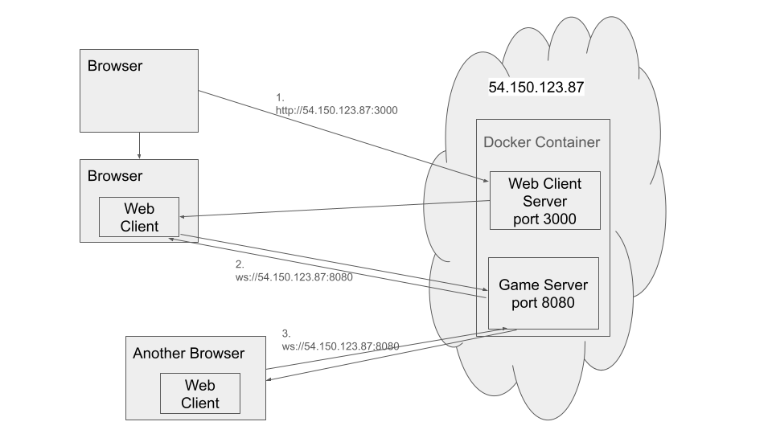

# About
PGOnlineは、Webブラウザで動作するオンラインゲームである。
ゲーム内容は[スーパーマリオパーティ ジャンボリー](https://www.nintendo.com/jp/switch/a7hla/index.html)の「プクプクとゲッソー」というミニゲームのコピーである。

2名のユーザがWebクライアントを起動すると、ゲームが開始する。ユーザは左右の矢印キーで、バーを操作する。
ゲームの処理はサーバで行われ、Webクライアントはユーザ入力の送信と、ゲーム状態の受信・描画のみを行う。

Amazon Lightsailを用いて、[http://54.150.123.87:3000](http://54.150.123.87:3000)にデプロイしてある。このIPアドレスに接続すると、Webクライアントを起動できる。2つのWebクライアントが起動すると、ゲームが始まる。ただし、ゲームの読み込みが完了した後に、ブラウザを一度画面に表示しないと(フォアグラウンドプロセスにしないと)、ゲームが開始しない。

# Boot
本リポジトリをクローンしたら、次のコマンドで起動できる。

```
cd pgonline
docker compose up --build -d
```

コマンドを実行すると、ゲームサーバ(server)とWebクライアント用サーバ(client)のDockerコンテナが、それぞれローカルホストに立ち上がる。
ポート番号は、serverが8080、clientが3000にバインディングされる。

[http://localhost:3000](http://localhost:3000)を開くと、Webクライアントが起動する。

# Use case

ユーザがゲームをプレイする時に起こることを、上図に記述している。
本システムは、Webクライアントとゲームサーバからなる。
1. ユーザがWebクライアント用サーバ[http://54.150.123.87:3000](http://54.150.123.87:3000)にHTTP通信でアクセスし、ブラウザでWebクライアントが動作する。
2. Webクライアントがゲームサーバ[ws://54.150.123.87:8080](ws://54.150.123.87:8080)にWebSocket通信でアクセスする。
3. ゲームサーバに2つのWebクライアントが同時にアクセスすると、ゲームサーバでゲームが開始する。
  - ゲームの実行中、Webクライアントがゲームサーバにユーザの操作を送信し続ける。ゲームサーバはWebクライアントにゲームの状態を送信し続ける。

# Deployment
[Amazon Lightsail](https://lightsail.aws.amazon.com/)にデプロイしている。AWSのシンプルなレンタルサーバである。

# Project
プロジェクト構成について、重要なファイルをピックアップして説明する。

- client:   Next.js製のWebクライアントアプリケーション。
  - public
    - unity:    WebGL向けにビルドしたUnity製ゲームを格納する。
    - src/app
      - page.tsx:   メインのWebページを定義する。単にpublic/unityにあるゲームを読み込み、表示している。
- server:   RustのTauri-Tungstenite製のゲームサーバ。
  - src
    - main.rs:  サーバプログラムのエントリポイント。クライアントとWebSocket通信を行い、ゲームの非同期タスクとやり取りする。
    - game:     ゲームの処理を行う、非同期タスクを定義する。
      - game.rs:    ゲームループを定義する。
      - bar.rs:     ゲーム中でプレイヤーが操作できる棒の挙動を定義する。
      - bubble.rs:  ゲーム中で転がってくる玉の挙動を定義する。
      - shared_memory.rs:   src/main.rsのタスクとsrc/gameのタスクがやり取りする情報を定義する。
- unity/PGClient:   Webクライアントで操作できるUnityゲームを開発するプロジェクト。WebGL向けにビルドしたものが、既にclient/public/unityに入っている。
  - Assets/Scripts: 書いたコード。
    - Connection.cs:    ゲームサーバとのWebSocket通信を確立し、ユーザの入力を送信し、ゲームの状態を受信する。
- protocol.md: WebSocket通信で送受信するバイナリについて、その作成ルールを説明する。